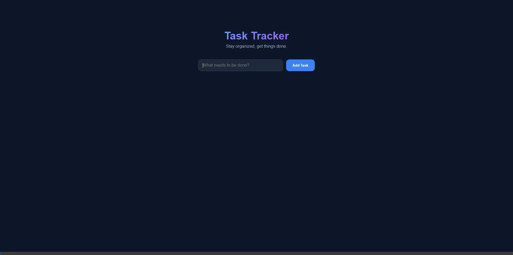

# Task Tracker

A simple, modern, and beautiful web application to track your daily tasks. Built with vanilla HTML, CSS, and JavaScript.



## Features

-   **Add Tasks**: Quickly add tasks using the input field and "Add Task" button or by pressing Enter.
-   **View Tasks**: All your tasks are displayed in a clean, scrollable list.
-   **Mark Completed**: Toggle tasks as "Done" or "Undo" them if you change your mind. Completed tasks are visually distinguished.
-   **Responsive Design**: Works perfectly on desktop and mobile screens.
-   **Modern UI**: Features a dark mode aesthetic with vibrant accents and smooth animations.

## How It Works

The application stores your tasks in the browser's memory while you are using it.
1.  **Type** your task description in the input box.
2.  **Click 'Add Task'** or press **Enter**.
3.  **Click 'Done'** on any task to mark it as finished.
4.  **Click 'Undo'** to revert a completed task to pending.

## how to Start

You can run this project in two easy ways:

### Option 1: Open Directly
Simply navigate to the project folder and double-click `index.html` to open it in your default web browser.

### Option 2: Run a Local Server (Recommended)
For the best experience, run a local server:

**Using Python:**
```bash
python -m http.server
```
Then open `http://localhost:8000` in your browser.

**Using Node.js (npx):**
```bash
npx serve
```
Then open `http://localhost:3000` in your browser.

## Project Structure

-   `index.html`: The main structure of the application.
-   `style.css`: Contains all the styling, animations, and responsive rules.
-   `script.js`: Handles the application logic (adding, toggling, and rendering tasks).
-   `assets/`: Contains images and media for documentation.
